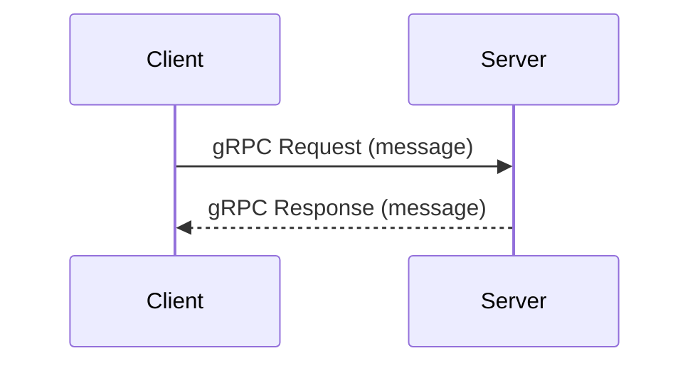
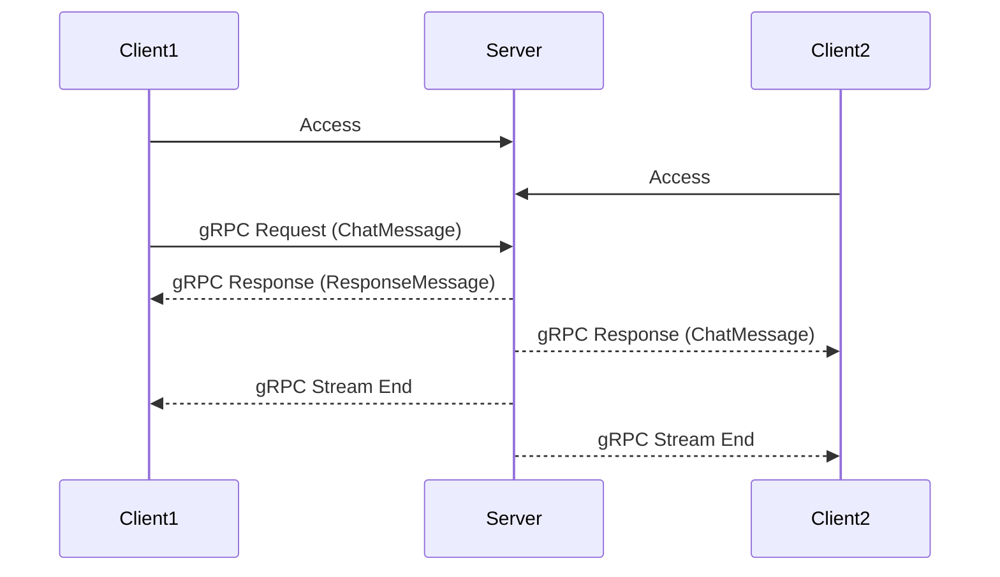

# シーケンス図
# Unary RPCの場合

```mermaid
sequenceDiagram
    Client->>Server: gRPC Request (message)

    Server-->>Client: gRPC Response (message)
```

# Server Streaming RPCの場合

```mermaid
sequenceDiagram
    Client1->>Server: Access
    Client2->>Server: Access
    Client1->>Server: gRPC Request (ChatMessage)
    Server-->>Client1: gRPC Response (ResponseMessage)
    Server-->>Client2: gRPC Response (ChatMessage)
 
    Server-->>Client1: gRPC Stream End
    Server-->>Client2: gRPC Stream End

```
